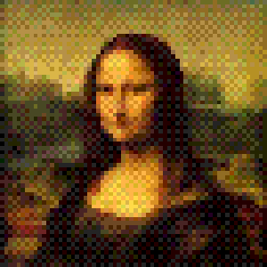
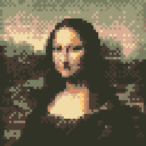
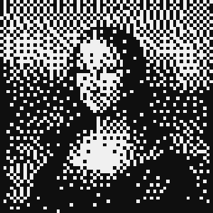

<p align="center"></p>

<h3 align="center">Make images look like pixel art</h3>

<p align="center">   <a href="LICENSE"></a><a href="https://github.com/MiguelMJ/MakeItPixel/wiki"></a></p>

## Preview

Original: 


Example results:

|||
|-|-|
| |  |
|  |  |

</p>

<strong>Table of contents</strong>

- [Preview](#preview)
- [Features](#features)
- [Dependencies](#dependencies)
- [Build](#build)
- [Contributing](#contributing)
- [Contributors](#contributors)
- [Usage](#usage)
  - [CLI options](#cli-options)
  - [Configuration](#configuration)
    - [Scaling](#scaling)
    - [Color quantization](#color-quantization)
    - [Palette](#palette)
- [License](#license)


## Features

- Intelligent handling of color and palettes.
- Configure color selection during downscaling.
- Configure color quantization and dithering.
- Fully customizable both by file and console.
- Process dozens of files with in a single run.

## Dependencies

- [SFML v2.5.1](https://www.sfml-dev.org/index.php) ([release](https://github.com/SFML/SFML/releases/tag/2.5.1))

## Build

If you have the dependencies installed and a C++ compiler, you can simply run:

```shell
g++ src/* -Iinclude -lsfml-graphics -o makeitpixel
```

## Contributing

- Read the [contributing guidelines](CONTRIBUTING.md) if you want to contribute to the code.
- Open a new issue [](https://github.com/MiguelMJ/Candle/issues/new) to make a request or report a bug.
- If you use it in a project, you don't have to give any credit. But if you did so, that would be fantastic!
- And of course, :star:  **star this repository** and give it some visibility [](https://github.com/MiguelMJ/Candle/stargazers).

## Contributors
This list is empty... for now ;)

***

## Usage

> In the [wiki](https://github.com/MiguelMJ/MakeItPixel/wiki)) you'll find a detailed explanation of how MakeItPixel works and how to configure it.

```
makeitpixel [-h] [-c FILE] [-x JSON] [-o DIR] FILES..
```
### CLI options

| Option | Description |
|---|---|
| `-h, --help` | Print this help message and exit. |
| `-x, --config  CONFIG` | Set the CLI configuration as a JSON formatted string. |
| `-c, --config-file PATH` | Set the configuration file. |
| `-o, --output-dir DIR` | Set the output directory for the generated images. |

### Configuration

There are two levels of configuration:

1. File configuration. Overwrites default options.
2. CLI configuration. Overwrites file configuration and default options.

The configuration is specified in JSON format. Configuration parameters will be explained in detail below.

#### Scaling

The first step of the process is reducing the size of the image. The parameters involved are:

- **`width`**: Maximum width of the resultant image. Must be a number (default = 64).
- **`height`**: Maximum height of the resultant image. Must be a number (default = 64).
- **`select_pixel`**: Scaling down an image results on a loss of information, so this parameter tells what pixels to keep:
  | Value | Effect |
  |---|---|
  | `"min"` | Take the darker pixels. Results in darker images. |
  | `"max"` | Take the lighter pixels. Results in lighter images. |
  | `"med"` | Take the median pixel. Results in sharper images. |
  | `"avg"` (default) | Take the median pixel. Results in smoother images. |
- **`normalize`**: To take advantage of the color processing to be performed later, may want to normalize the image (Make the lightest color white and the darkest, black).
  | Value | Effect |
  |---|---|
  | `"no"` (default) | Don't perform any normalization. |
  | `"pre"` | Normalize before scaling. |
  | `"post"` | Normalize after scaling. |

#### Color quantization

The second step, optionally, is reducing the color space of the image. Certain strategies might require palette configuration.

- **`quantization`**: Strategy for choosing the new color of a pixel.
  | Value | Effect |
  |---|---|
  | `"none"` (default) | Skip this step and leave the image as it is after scaling. |
  | `"bit1"`, `"bit2"`, ..., `"bit8"` | Set the bits available to represent color for each RGB channel. `"bit1"` reduces the space to just 8 colors and `"bit8"` results in no change (equivalent to `"none"`). |
  | `"closest_rgb"` | Choose the color from the palette that's closer in the RGB space. Useful for rich palettes. |
  | `"closest_gray"` | Choose the color from the palette with a closer gray value. Useful for sequential palettes. |
  
- **`dithering`**: Object with parameters for dithering, listed below.
- **`dithering.method`**: Algorithm for dithering to apply during the quantization.
  | Value | Effect |
  |---|---|
  | `"none"` (default) | Quantize without dithering. |
  | `"floydsteinberg"` | Use the Floyd-Steinberg algorithm, based on error propagation.  |
  | `"ordered"` | Use a matrix for an ordered dithering algorithm.  |
- **`dithering.matrix`**: For ordered dithering. Matrix to use: `"Bayes2"`, `"Bayes4"` (default) or `"Bayes8"`, that result in squared patch-like patterns; `"Horizontal2"` or `"Horizontal4"`, that result in horizontal patterns; `"Vertical2"` or `"Vertical4"`, that result in vertical patterns.
- **`dithering.threshold`**: Not implemented (default = 0).
- **`dithering.sparsity`**: For ordered dithering. Distance expected between the possible values of each RGB channel in the reduced color space.
  | Value | Effect |
  |---|---|
  | `"auto"` (default) | Compute most convenient sparsity for the quantization strategy and/or palette. |
  | Any number between 0 and 255 | Specify manually the distance. A `0` value results in no dithering at all. |

#### Palette

If you are using a quantization strategy that requires a palette, you can configure it with the following parameters:
- **`palette`**
  - A literal palette can be specified as an array of strings containing the hexadecimal values of the colors.
  - An auto-generated palette will be used if this value is an object. The parameters inside this object are described below.
- **`palette.main`**: A single color to use as reference. Must be a string with an hexadecimal value (default = "00ff00").
- **`palette.scheme`**: Color scheme to generate the base colors of the palette from the main one.
  | Value | Base colors | Shifted hue degrees |
  |---|---|---|
  | `"mono"` | 1 | 0 |
  | `"analogous"` (default) | 3 | 30, 60 |
  | `"complementary"` | 2 | 180 |
  | `"split_complementary"` | 3 | 150, 210 | 
  | `"triadic"` | 3 | 120, 240 |
  | `"rectangle"` | 4 | 60, 180, 240 |
  | `"square"` | 4 | 90, 180, 270 |
- **`palette.spectre`**: Defines how the palette is extended from the base colors, adding brighter and darker colors.
  | Value | Effect |
  |---|---|
  | `"linear"` | Only add darker values for the darker base color and the same for the brighter ones. Results in sequential palettes. |
  | `"complete"` | Add darker and brighter values for each base color. Result in richer palettes. |
- **`palette.inter`**: Aproximate number of intermediate darker and brighter values.
- **`palette.disparity`**: Factor between 0 and 1 to get the darker and brighter values of the palette by interpolation. A value of 0 results in leaving only the base colors; a value of 1 includes black and white in the palette. Must be a number between 0 and 1 (default = 0.85). 

***

## License

Make It Pixel uses the MIT License, a copy of which you can find [here](LICENSE), in the repo.

The external library SFML is licensed under the zlib/png license.
